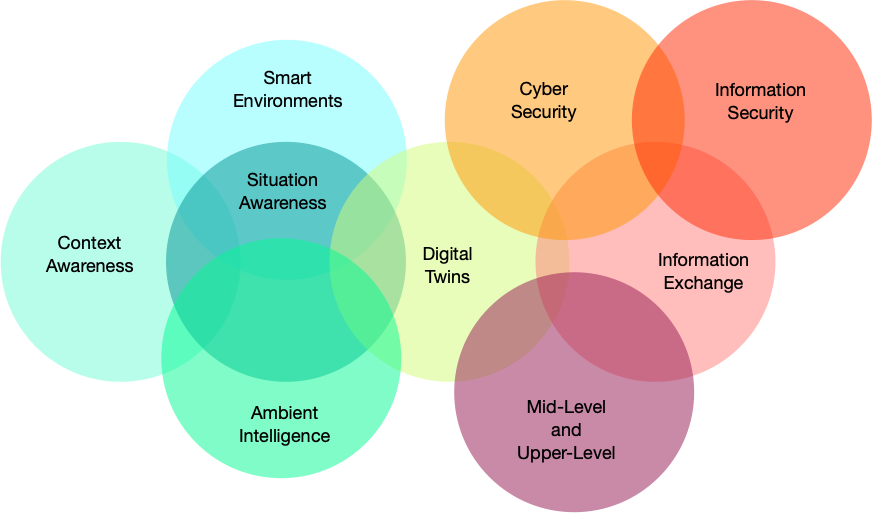

# DISO: Defence, Intelligence and Security Ontologies

**DISO** is a collection of publicly available OWL ontologies relating to the domains of **defence, intelligence and security**.  

## Overview

The ontologies in DISO were identified and obtained during an **ontology search** exercise undertaken during Nov/Dec of 2025.
  
Each ontology is accompanied by some amount of documentation providing information such as: a full name, short description, relevant context, web presence, and the source from which the ontology was obtained.

The motivation for establishing the DISO repository has to do with the research problem of OWL **ontology alignment**.  Using DISO, the ambition is to create a **defence, intelligence & security track** for the [Ontology Alignment Evaluation Initiative (OAEI)](https://oaei.ontologymatching.org/).  OAEI tracks contain one or more **ontology alignment tasks**. An OAEI ontology alignment task involves a pair of ontologies whose domains overlap (or abut) in such a way that they pose interesting alignment opportunities and challenges. The pair of ontologies is accompanied by a **reference alignment** (a ground-truth alignment).  The **reference alignment** permits the quality (accuracy, recall, precision, etc.) of alignments generated by **matching systems** (ontology alignment software systems) to be evaluated. 

## Subdomains (categories, clusters)

Most of the ontologies in DISO cluster into categories (or subdomains) of the umbrella domains of defence, intelligence and security. The structure of this repository reflects this clustering. Sometimes, an ontology fits into more than one cluster (subdomain).  Each ontology appears only once in the repository, however --- in the cluster where the fit is deemed strongest.

## Relaxed domain definitions

The domains of **defence, intelligence and security** have been **interpreted broadly**. The connection between some of the subdomain clusters and the umbrella domains may appear tenuous. In the README files for these subdomains, we provide information and cite sources to help explain and justify our decision to include the subdomain within DISO.

## Merged ontologies

Some of the ontologies in DISO are distributed as networks of component ontologies, woven together with `owl:imports` statements. For some of these, we have **merged** the component ontology files into a single ontology file, using the Protege ontology editor.

## DISO cluster conceptual overlaps

This diagram provides a view of the conceptual overlaps that exist between various clusters (or subdomains) of the DISO collection of defence, intelligence and security ontologies.

## Towards an OAEI track ...

Anticipated next steps with respect to creating a **defence, intelligence & security** OAEI track:
* analyse and evaluate the ontologies in DISO
* conduct exploratory alignments within each subdomain (cluster)
* identify intra-cluster candidate pairs (alignment tasks)
* identify one or more cluster ontologies suitable for inter-cluster analysis
* conduct exploratory inter-cluster alignments
* identify inter-cluster candidate pairs (alignment tasks)
* select a final (small) set of ontology pairs (alignment tasks)
* establish **reference alignments** for the final set of alignment tasks
* establish the defence, intelligence & security OAEI track.

